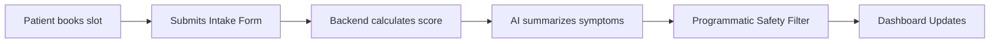

# ClinicFlow Presentation Slides

---

## Slide 1: Title & Overview
### **ClinicFlow: AI-Assisted Clinic Appointment & Intake System**
*   **Domain:** Healthcare Administration & Workflow Optimization
*   **Track:** Software Development & AI (SDAI)
*   **Authors:** ClinicFlow Dev Team
*   **Objective:** Streamline front-desk patient intake checking and summary reporting while preserving patient safety.

---

## Slide 2: Problem & Real-World Impact
### **The Administrative Bottleneck**
*   Front-desk staff spend extensive time identifying incomplete intake files.
*   Chasing patients for missing insurance details or medical allergies creates delays.
*   Manual message writing slows down patient turnaround times.
*   **The Solution:** An automated system generating factual administrative intake summaries, highlight missing details, and draft polite follow-ups.

---

## Slide 3: Dataset & Database Schema
### **Integrated Data Layer**
*   Seeded with **50+ realistic synthetic records** (patients, appointments, intake forms, follow-ups).
*   **Structured SQL Database:** SQLite with SQLAlchemy ORM.
*   **Completeness Score:** Deterministic checking of mandatory fields (`symptoms_description`, `current_medications`, `allergies`, `insurance_provider`, `insurance_id`, `preferred_language`).

---

## Slide 4: System Workflow
### **Core Data Pipeline**

*   *Consent-Driven:* Patients must explicitly agree to administrative AI summaries before submission.

---

## Slide 5: Software & AI Innovation
### **Factual Summarization & Multi-Layered Security**
*   **Administrative AI Agent:** Anthropic Claude reads raw intakes and drafts responses.
*   **Regex Safety Scrubber:** Backend scans AI output text, stripping clinical assertions (like "treatment", "prescribe", "diagnosis") and replacing them with safety labels.
*   **Emergency Guardrail:** Severe symptoms trigger high-priority alerts (`urgent_review_needed`) for immediate routing to clinicians.

---

## Slide 6: Prototype Demo Screens
### **Staff Triage Dashboard**
*   **Metrics Cards:** Live counts of today's slots, incomplete intakes, and pending follow-ups.
*   **Queue Table:** Eager-loaded queues featuring appointment details and color-coded status badges.
*   **AI Summary Panel:** Clear AI summary visual tags explicitly separating machine text from clinical observations.

---

## Slide 7: Safety & Test Evaluation
### **Automated Test Results**
*   **Adversarial Testing:** Pre-designed adversarial prompts (e.g., patient asking for drug prescriptions) pass through safety asserts.
*   **Fallback Reliability:** Seamless rule-based mock summarization operates flawlessly if the Anthropic API is offline.
*   **Status Logs:** Automatically records status change pathways (`requested` → `confirmed` → `checked_in`) to ensure clear workflow trails.

---

## Slide 8: Limitations & Responsible Use
### **Safe Deployment Boundaries**
*   **Not a Diagnostic Tool:** Never interprets clinical status; strictly reports plain factual summaries.
*   **Human-in-the-Loop (HITL):** Staff members must review and edit all auto-drafted follow-ups; no automatic messaging is supported.
*   **Data Scopes:** Current scope does not evaluate long-term historical charts.

---

## Slide 9: Future Extensions
### **Roadmap Details**
*   **Integrated Messaging:** Connect SMS gateways (Twilio) and Email delivery networks (SendGrid) for approved messages.
*   **Biometric & MFA Access:** Secure authenticated clinical logins.
*   **Multi-Language Audio Intake:** Auto-transcribe patient-spoken reports into plain text records.

---

## Slide 10: Conclusion
### **Efficiency Meets Safety**
*   ClinicFlow optimizes front-desk workflows, reducing manual triage time.
*   Safety remains central via deterministic checking, strict prompt limits, programmatic filters, and human-in-the-loop review.
