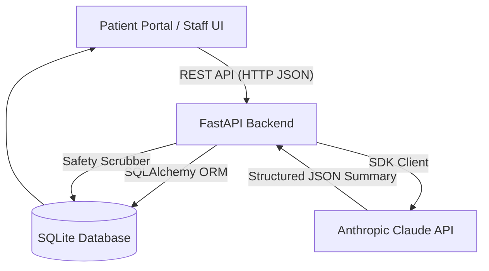
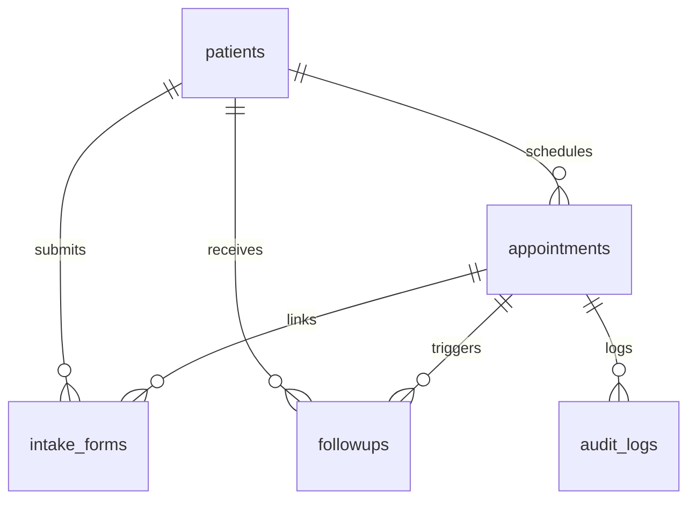

# ClinicFlow Project Report

**Track:** Software Development & AI (SDAI)  
**System:** Clinic Appointment and Intake Summary System  
**Author/Team:** Individual Project  
**Date:** July 2026  

---

## Table of Contents
1. [Problem Statement & Stakeholders](#1-problem-statement--stakeholders)
2. [Real-World Impact](#2-real-world-impact)
3. [System Architecture & Pipeline](#3-system-architecture--pipeline)
4. [Dataset & Schema Mapping](#4-dataset--schema-mapping)
5. [AI Module Design & System Prompting](#5-ai-module-design--system-prompting)
6. [Safety Guardrails & Fallback Logic](#6-safety-guardrails--fallback-logic)
7. [Limitations & Future Improvements](#7-limitations--future-improvements)
8. [Responsible-Use Guidelines](#8-responsible-use-guidelines)

---

## 1. Problem Statement & Stakeholders

Clinic administrative staff spend vast amounts of manual time matching patient intake forms with scheduling slots, identifying missing mandatory details (e.g. allergies, insurance policy numbers), and drafting patient follow-ups.

This project implements a web-based portal to resolve these bottlenecks through automated, AI-assisted triaging support.

### Key Stakeholders
*   **Patients:** Submit reason-for-visit requests and fill out simple intake forms quickly.
*   **Front-Desk Staff:** View today's queue, check completeness scores, and send pre-drafted follow-up messages.
*   **Clinicians:** Read objective summaries of patient-reported symptoms before consultations without clinical assumptions or suggested diagnoses.

---

## 2. Real-World Impact

By automating administrative tasks (like identifying missing fields and writing follow-up reminder drafts), ClinicFlow reduces front-desk overhead. However, in medical contexts, the risk of AI-induced misinformation is high. ClinicFlow mitigates this by restricting the AI to administrative support only, enforcing strict system prompt constraints, and running a secondary programmatic filter over all outputs to guarantee zero clinical assertions or diagnoses reach clinic screens.

---

## 3. System Architecture & Pipeline

ClinicFlow is built on a clean client-server architecture:



### Flow description:
1.  **Patient Booking:** The patient enters booking details.
2.  **Intake Submission:** The patient completes the intake form with mandatory consent for AI processing.
3.  **Completeness Check:** The backend determines the completeness score deterministically.
4.  **AI Summary:** The summarizer triggers (Claude or mock fallback), creating a summary and draft follow-up.
5.  **Safety Filter:** The scrubber cleans the text before saving.
6.  **Staff Triage:** Staff reviews the summary, updates appointment status, and edits/approves draft reminders.

---

## 4. Dataset & Schema Mapping

The database (`clinic.db`) consists of five tables managed via SQLAlchemy:

### Schema Overview


*   **`patients`**: Stores basic biographical and contact data.
*   **`appointments`**: Holds time slots, department, and current state (`requested`, `confirmed`, `checked_in`, `completed`, `cancelled`, `no_show`).
*   **`intake_forms`**: Connects appointment symptoms and insurance info with deterministic completeness scores and AI summaries.
*   **`followups`**: Holds auto-drafted SMS/email reminders.
*   **`audit_logs`**: Tracks appointment status change history and logging operators for workflow verification.

---

## 5. AI Module Design & System Prompting

The AI module connects with Anthropic Claude using a dedicated system prompt:

```text
You are an administrative intake summarizer for clinic front-desk staff.
Your role is purely administrative support.
CRITICAL SAFETY RULE: You are NOT a doctor or clinician. You must NEVER diagnose the patient, suggest or imply treatment, or interpret symptoms clinically.
Only restate, in plain factual language, what the patient reported. Do not add medical terms or clinical judgments.
Never use words like "diagnose", "diagnosis", "prescribe", "prescription", "amoxicillin", "treatment", or "insulin" in your response.
```

The AI returns a structured JSON object:
```json
{
  "summary": "Concise factual summary of patient symptoms.",
  "flags": ["Administrative warnings based ONLY on reported info."],
  "follow_up_draft": "Professional message requesting missing details.",
  "urgent_review_needed": false
}
```

---

## 6. Safety Guardrails & Fallback Logic

ClinicFlow implements a multi-layered guardrail design to prevent unsafe claims or failures:

1.  **Programmatic Regex Filter:** A custom wrapper inspects AI strings and replaces clinical terms (like `prescribe`, `amoxicillin`, `cure`, etc.) with `[clinical term removed for safety]`.
2.  **Deterministic Mock Fallback:** If the API fails or no API key is configured, the system shifts to a keyword-based rule parser. The UI remains responsive.
3.  **Emergency Flagging:** If symptoms indicate potential emergencies (e.g. chest pain, breathing difficulty), the system marks `urgent_review_needed` as `true` and prompts immediate clinical routing.

---

## 7. Limitations & Future Improvements

### Current Limitations
*   Summaries are generated per-intake and do not look at past patient history.
*   No real SMS/email gateway is connected (drafts are only shown inside the staff dashboard).

### Future Enhancements
*   Integration with email / SMS APIs (Twilio, SendGrid) to send approved reminders.
*   Secure multi-factor authentication (MFA) for staff access to protect patient health information.

---

## 8. Responsible-Use Guidelines

*   **Human-in-the-Loop:** Front-desk staff must read and approve/edit every auto-drafted message before mark-as-sent.
*   **Administrative Only:** This application is designed solely for operational triage. It is not an alternative to emergency care or professional clinical assessments.
